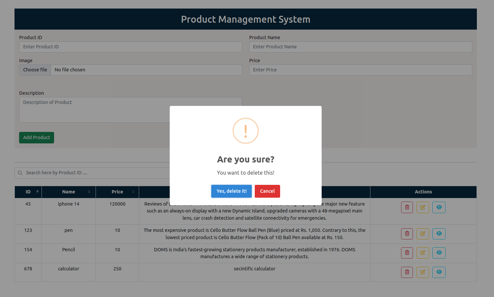
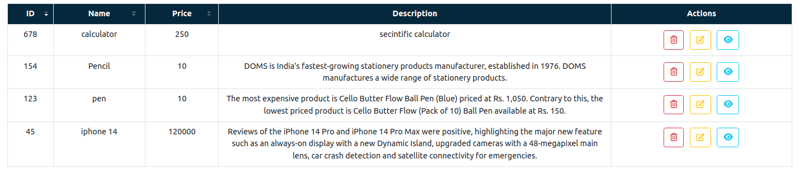
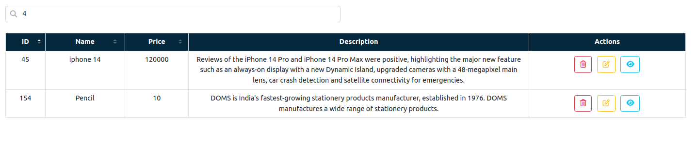

# CRUD Operation

- CRUD refers to the four basic operations a software application should be able to perform – Create, Read, Update, and Delete.
- Here I bulid Product Management System that perform CURD Operation.I make a CRUD app with only client-side javascript.
- In this site user can add product details,update it,read it and delete product.

## Tech Stack

- This Project is Build With Some Famous Tech And Tools Which Are Mentioned Below... 👇
  

## Screenshot

### Add Product

### Update Product

### Read(View) Product

### Delete Product

### Sort by Ascending order

### Sort by Descending order

### filter by Product ID

## 🚀 Live Demonstraion

[Preview Site](https://jupinsimform.github.io/lms-CRUD-Operation-in-Javascript/)
